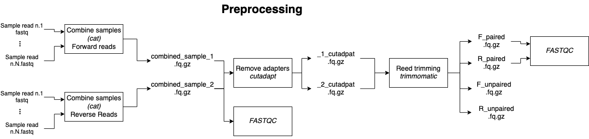
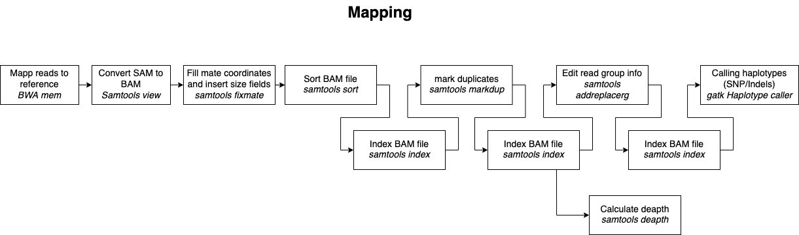

# Variant Calling using short read sequences against reference

Author: Edgars Liepa  
email: edgars.liepa@biomed.lu.lv  
Latvian Biomedical Research and Study Center  

# !!! Important

Scripts have defind static file and dependency paths. If you are planing to use any of scripts at this development stage 
beware that you need to change them to corespond to your needs. 

## Description

Assembly of Goshawk genome against reference sequence bAccGen1.1 from short read sequences.

Analysis was done on RTU HPC that uses Cent OS and Torque resource maneger. 

**Reference used** - [bAccGen1.1](https://www.ncbi.nlm.nih.gov/assembly/GCF_929443795.1/) 

### Pipeline

## Files

combineFiles.sh - combine raw reads files from sequencer to correspond to sample and add corect name, because sequencing reads from same sample where distributed in a multiple places on a sequecing chip. 

collect_insert_size.sh - CollectInsertSizeMetrics and get read counts from BAM file

coverage.sh - calculate genome coverage with bedtools

deapthAndMapped.sh - Calculate Read depth, coverage, proportion of mapped reads

get_fastqc_report.sh - Create FastQC report from BAM files with marked duplicates

gatk.databse_vanagi - create GenomicsDB from g.vcf files

extractVCF.sh - create VCF file from GenomicsDB

extract_VCF_GPU.sh - create VCF file from combined GVCF file using NVIDIA Parabricks GPU acceleration. 

makeDB.sh - create Genomcs DB from VCF files

mapping.sh - map reads to reference, m ate coordinates, sort, index, mark duplicates, calculate deapth, index and call haplotypes. 

index_Reference.sh - index Reference sequence

intervals.list - file for RGI #todo check content

parseFASTQC.scv - Gather results from FASTQC result HTML files and create csv results file.

raw_reads - folder with raw read data

raw_reads/starpfaili - folder with intermidiate result files (BAM, SAM, VCF)

samT_stats.sh - gather statistics with *samtools satats* program

qualimap.sh - create BAM file statistics using *qualimap bamqc*

WGS_raw_pipeline.sh

## Dependencies

- bwa
- gatk
- samtools
- picard
- fastqc
- bedtools
    - bedtools genomecov
- NVIDIA parabrics
- vcfstats
- qualimap bamqc

## TODO

- [ ] Results folder where analysis main results are compiled would be nice.
    - [X] Create results and temporary file folders
    - [ ] Make sure that all in scripts paths are leading to results folder
- [ ] Describe analysis pipeline
    - [ ] Create a pipiline describing diagrams
    - [ ] Describe how to use scripts
    - [ ] Describe result files generated
    - [ ] Describe directory structure
- [ ] Add all used programs
- [ ] Should I configure file paths ass comand line passable arguments?? 
or 
- [ ] Should I specifically document that scripts needs to be edited If thats the case:. 
    - [ ] add empty argument fields.
    - [ ] add before execution that all fields are set.
    - [ ] Create relative paths for structural folders
        - [ ] Set script location folder as current WORKDIR after job is sent.